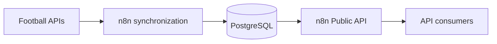

# Football Matches API

Единый REST API для получения расписания, статусов и результатов футбольных матчей.

Сервис получает данные из внешних футбольных API, нормализует их через n8n, сохраняет в PostgreSQL и отдаёт потребителям в едином JSON-формате.

## Architecture



## API endpoint

```http
GET https://n8nforstudy.ru/webhook/matches
```

Обязательный query-параметр:

| Параметр | Значения | Описание |
|---|---|---|
| `competition` | `rpl`, `wc2026` | Код футбольного турнира |

## Example requests

```bash
curl 'https://n8nforstudy.ru/webhook/matches?competition=rpl'
```

```bash
curl 'https://n8nforstudy.ru/webhook/matches?competition=wc2026'
```

## Response example

```json
[
  {
    "externalId": "highlightly:1328802393",
    "competition": "rpl",
    "round": "17",
    "group": null,
    "stage": "LEAGUE",
    "homeTeam": "Akhmat Grozny",
    "awayTeam": "Lokomotiv Moscow",
    "kickoffUtc": "2026-12-05T16:00:00.000Z",
    "status": "SCHEDULED",
    "score": {
      "fullTimeHome": null,
      "fullTimeAway": null,
      "extraTimeHome": null,
      "extraTimeAway": null,
      "penaltyWinner": null
    }
  }
]
```

## Status values

- `SCHEDULED`
- `LIVE`
- `FINISHED`
- `POSTPONED`
- `CANCELLED`

## API documentation

OpenAPI-спецификация находится в [`docs/openapi.yaml`](docs/openapi.yaml).

## Technology stack

- n8n
- PostgreSQL
- REST API
- OpenAPI 3.1
- Swagger UI
- GitHub
